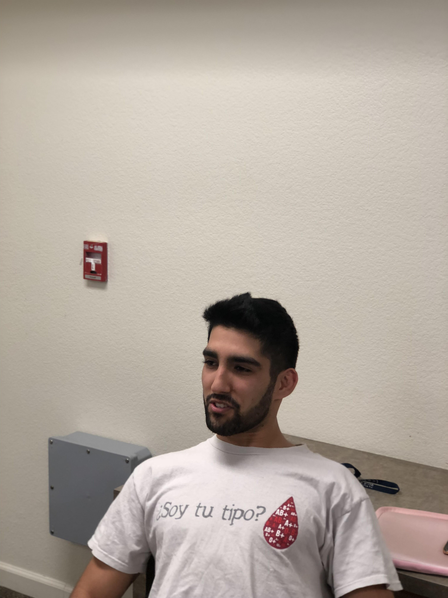

# https://trello.com/b/SPJs3g3S/ecs-189e-group-project

Krishna: https://github.com/kchennap  
Ibo: https://github.com/ibrahimelsakka  
Luc: https://github.com/lnglankong  
Ali: https://github.com/ayatebar3  

## Designs for screens: 

The Login Screen is the first ViewController shown to the user. The Create Account button is available in the case of a user not having an account.
The plan to traverse through these view controllers is by initially providing the user with a tabular format of the main three view controllers, which are History View Controller, Workouts View Controller and Timer View Controller. The Workouts View Controller will have the option to add a new workout, which will load a new view controller to select a body area, which further loads a new view controller to view all the exercises specific to that body area. Once selected the workout is added to a list of workouts that the user can see, then save accordingly. The timer view has a list of timed routines, which the user can use, which have intervals with different times. The timer countdown view is the usage of the timer routine and the set timer view controller is for the user to set the time of the view controller.

The method used to make the transitions would be to instantiate the view controller and then push that view controller to the navigation stack. The variable used to instantiate the view controller has all the variable values within that view controller, so I set that specific variable to the variable we are transferring to the next view controller.

## Third party libraries:
1. [JTAppleCalendar](https://github.com/patchthecode/JTAppleCalendar)

## Models:
1. Workout summary
2. Timer routine templates
3. Workout templates
4. Exercise library
5. And supporting simple objects

## List of ViewControllers:
1. HomeViewController
2. CalendarViewController
3. CalendarDayViewController
4. WorkoutTemplatesViewController
5. ListWorkoutExercisesViewController
6. MuscleGroupViewController
7. SelectExerciseViewController
8. SelectTimerRoutineViewController
9. TimerCountdownViewController
10. CreateTimerViewController

## Testing plan:
ECS 189E Project: Testing Plan

Our primary mode of testing will be to test our code as we develop it. We will set up an "About the developers" page with an email where users can email us with bug reports, feedback, and desired features. The demographic for this application are people who are either new to or experienced with exercising. This is allows for a huge user base, as it would work as a motivator for those reluctant to work out, provides a base model of exercises and routines for those who have begun working out, and a model to keep track of various attributes, which is convenient for those more experienced. We can send this to friends and family members who wish to begin working out and use a group that exists in Davis to test the more experienced lifters.
